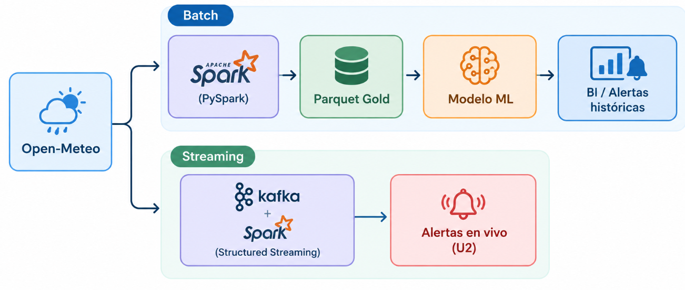

# Arquitectura Lambda – EcoData

## Decisión
Se seleccionó la **arquitectura Lambda**.

## Justificación
El proyecto requiere dos capacidades simultáneas:

- **Capa Batch (Unidad 1):** análisis histórico y entrenamiento de modelos.
- **Capa Speed (Unidad 2):** alertas en tiempo casi real.

Lambda permite mantener ambas rutas, alimentadas por la misma fuente (Open-Meteo).

## Componentes de la ruta Batch (Unidad 1)
- Extracción desde Open-Meteo
- Limpieza y controles de calidad
- Escritura en Parquet particionado
- Entrenamiento y comparación de modelos con Spark MLlib